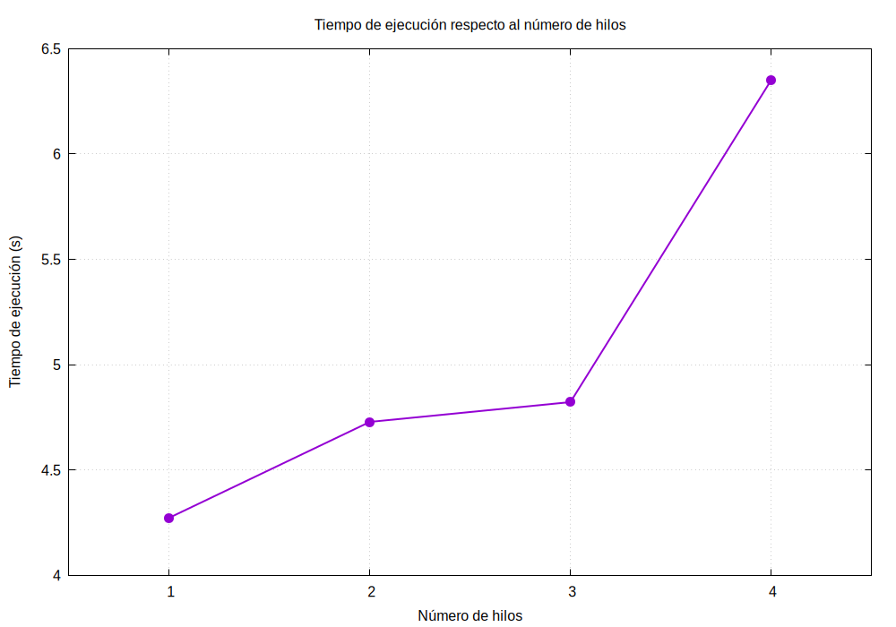
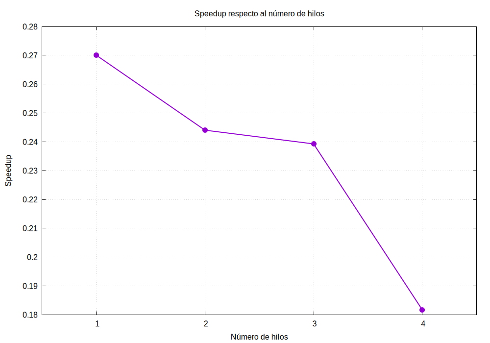
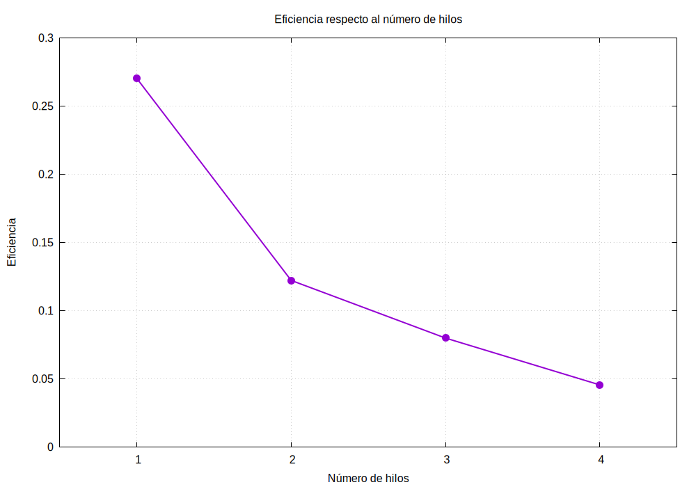
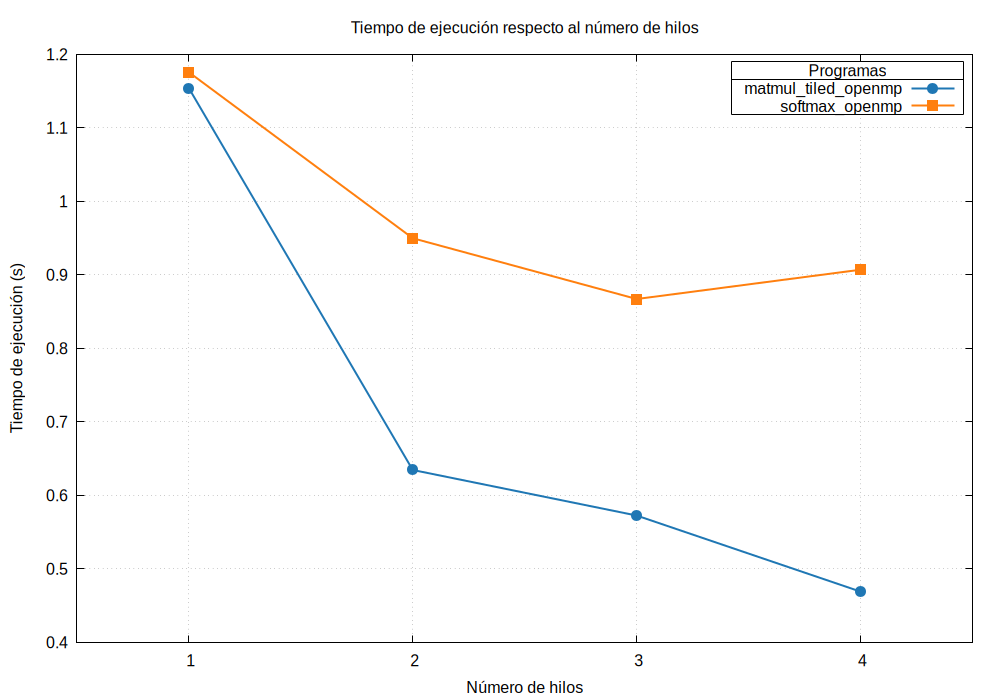
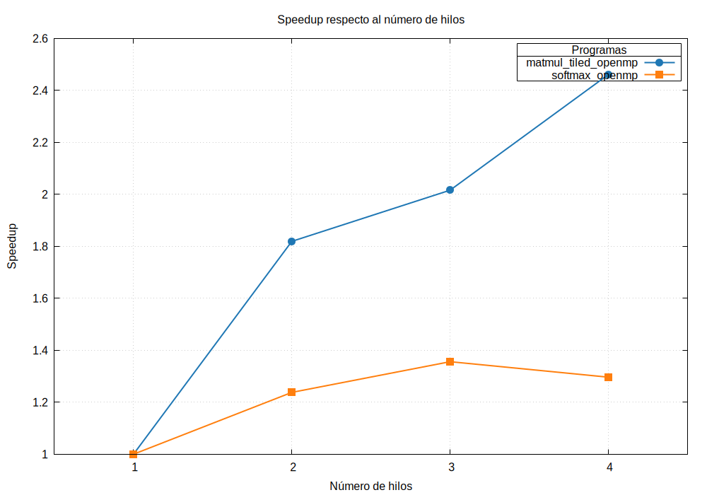
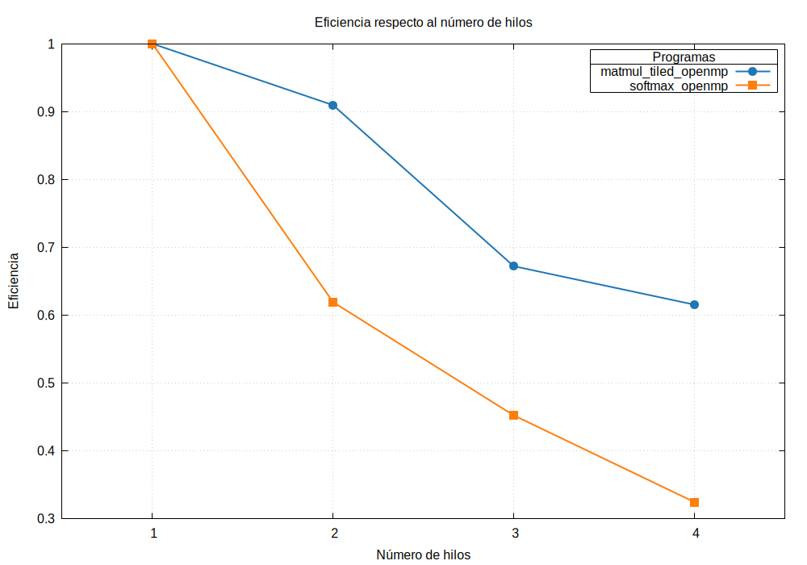

# Práctica de Clase 3

## Ejercicio A

Al compilar y ejecutar este ejercicio se encuentra con el problema de que los CPUs lógicos son insuficientes. El sistema en el que se ejecuta el ejercicio posee 4 y el programa requiere 8.
Por lo tanto se modifica el código para poder ejecutarlo.

Se modifica la constante `NUM_THREADS` por 4 en lugar de 8.

### Tabla de tiempos de ejecución| speedup y eficiencia

| Hilos | Tiempo (s) | Speedup | Eficiencia |
| :---: | :---------: | :------: | :---------: |
|   1   |      4.273 |   1.000 |      1.000 |
|   2   |      4.728 |   0.904 |      0.452 |
|   3   |      4.822 |   0.886 |      0.295 |
|   4   |      6.349 |   0.673 |      0.168 |

### Gráfico de tiempos según el número de hilos

### Gráfico de speedup según el número de hilos

### Gráfico de eficiencia según el número de hilos

### Parte paralelizable y serial

$s = \frac{\frac{N}{S(N)} - 1}{N - 1}$

$s = 1.65$

$p = 1 -s = 0.65$

### Análisis

De los resultados obtenidos y contrario a lo esperado por la ley de Amdahl se puede observar que este programa no demuestra una mejora al aumentar la cantidad de hilos que se utilizan para ejecutarlo. Es decir que experimenta una desaceleración al aumentar la paralelización.

Se identifica también el problema de que la proporción serial `s` es mayor a 1| lo que demuestra la invalidez de la ley de Amdahl para este caso. Ya que una parte del tiempo de ejecución no se utiliza ni en su porción serial ni paralela| sino que este tiempo (overhead) se utiliza para otras cosas| que puede incluir el manejo y creación de los hilos.

 
## Ejercicio B

### Tabla de tiempos de ejecución speedup y eficiencia

|Hilos|Tiempo matmul (s)|Speedup matmul|Eficiencia matmul|Tiempo softmax (s)|Speedup softmax|Eficiencia softmax|
| :---: | :---------: | :------: | :---------: |:------: |:------: |:------: |
1|1.153782|1.000|1.000|1.175397|1.000|1.000|
2|0.634376|1.819|0.909|0.949586|1.238|0.619|
3|0.572408|2.016|0.672|0.866913|1.356|0.452|
4|0.468902|2.461|0.615|0.906796|1.296|0.324|

### Gráfico de tiempos según el número de hilos

### Gráfico de speedup según el número de hilos

### Gráfico de eficiencia según el número de hilos

### Parte paralelizable y serial

$s = \frac{\frac{N}{S(N)} - 1}{N - 1}$

$s_{matmul} = 0.208$
$p_{matmul}  = 1 - s = 0.792$

$s_{softmax} = 0.695$
$p_{softmax}  = 1 -s = 0.305$

### Análisis

### Análisis

Ambos programas presentan un comportamiento diferenciado según la naturaleza de sus operaciones:

1. **`matmul_tiled_openmp`:** Muestra un rendimiento positivo con la paralelización. El tiempo de ejecución se reduce de $1.153\text{ s}$ a $0.468\text{ s}$ ($S_4 = 2.461$). La fracción serial calculada es del **20.8%** ($s = 0.208$), lo que explica que cerca del **79.2%** del código sea efectivamente paralelizable gracias al uso de bloques (*tiling*).

2. **`softmax_openmp`:** Muestra una alta porción serial estimada del **69.5%** ($s = 0.695$), lo que limita severamente el escalado. Aunque experimenta una aceleración máxima con 3 hilos ($S_3 = 1.356$), al utilizar 4 hilos el tiempo se incrementa a $0.906\text{ s}$ ($S_4 = 1.296$).

3. **Caída de la Eficiencia:** En ambos casos, la eficiencia decrece progresivamente a medida que aumentan los hilos. Esto confirma la presencia de *rendimientos decrecientes* causados por la fracción serial no paralelizable, sumado al *overhead* de sincronización y a la contención en el bus de memoria al escalar el número de hilos.

---

# Práctica de Clase 4

---

## Descripción del Hardware

| # | Property | Value |
|---|---|---|
| 1 | Processor model | AMD A12-9800 RADEON R7| 12 COMPUTE CORES 4C+8G |
| 2 | Architecture | x86_64 |
| 3 | Vector instruction sets | AVX2 |  
| 4 | CPU cores | 4 |
| 5 | CPU threads | 4 |
| 6 | Maximum CPU frequency | 3800.0000 MHz |
| 6 | Minimum CPU frequency | 1400.0000 MHz |
| 7 | RAM type | DDR4 |
| 8 | RAM capacity | 14Gi |
| 9 | L1 instruction cache | 192 KiB (2 instances) |
| 10 | L1 data cache | 128 KiB (4 instances) |
| 11 | L2 cache | 2 MiB (2 instances) |
| 12 | L3/LLC cache | Not available |
| 13 | Operating system | Ubuntu 26.04.1 LTS |
| 14 | Kernel version | 7.0.0-30-generic |
| 15 | Compiler version| gcc (Ubuntu 15.2.0-16ubuntu1) 15.2.0|

---

## Información General

### Autor

Brayan Rodríguez Villalobos

### Curso

Introducción a la Computación Heterogénea - EL-5859

### Profesor

Dr. Luis G. León-Vega

---

## IA

La documentación de este laboratorio se realizó con apoyo de inteligencia artificial.

[gemini](https://share.gemini.google/RzfgzXu8Clmv)

[chatgpt](https://chatgpt.com/share/6a963265-7f48-83e8-879e-9e97228bcfa1)